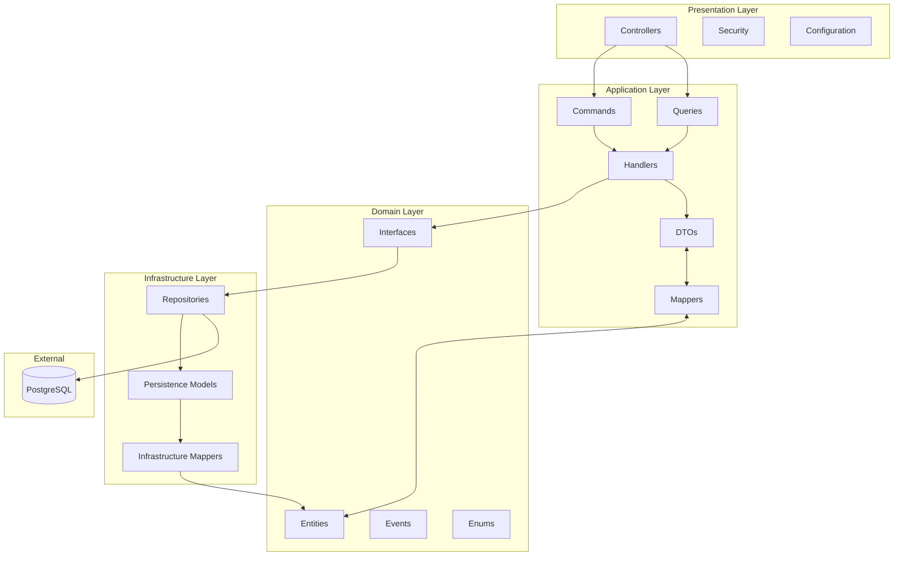
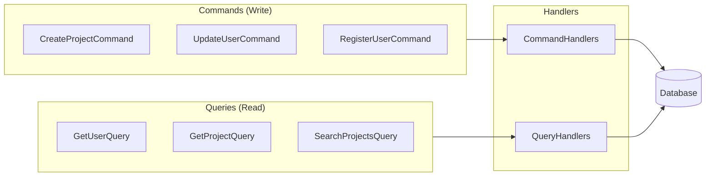
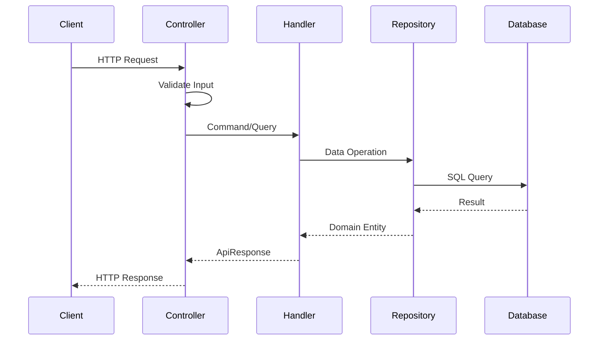
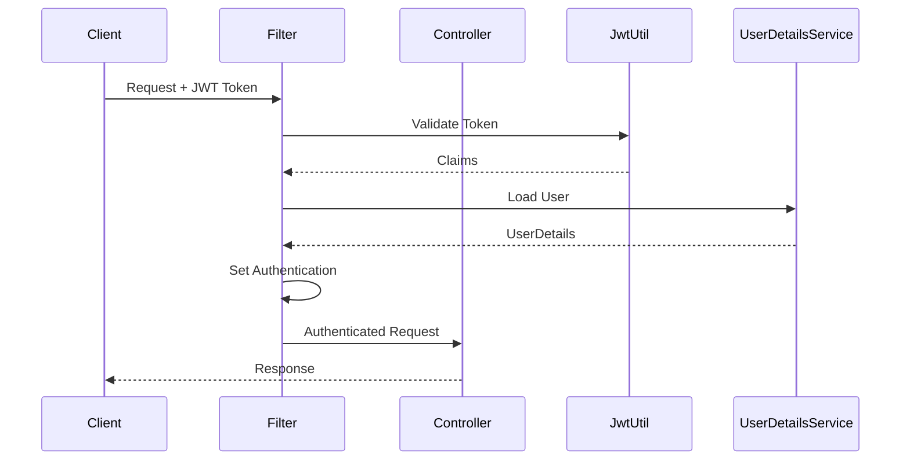

# Architecture Documentation

This document describes the architectural patterns and design decisions used in the Proje Pazarı Backend.

## Overview

The project follows **Clean Architecture** principles combined with **CQRS** (Command Query Responsibility Segregation) pattern to ensure maintainability, testability, and separation of concerns.

## Architecture Diagram



## Clean Architecture Layers

### 1. Presentation Layer (`presentation/`)

The outermost layer that handles HTTP requests and responses.

```
presentation/
├── controllers/    # REST API endpoints
├── security/       # JWT authentication, filters
└── config/         # Spring configuration classes
```

**Responsibilities:**
- Handle HTTP requests and responses
- Input validation (via Jakarta Validation)
- Authentication and authorization
- Transform API responses

**Key Components:**
- `AuthController` - Authentication endpoints (register, login)
- `UserController` - User management endpoints
- `ProjectController` - Project management endpoints
- `JwtAuthenticationFilter` - JWT token validation
- `SecurityConfig` - Spring Security configuration

---

### 2. Application Layer (`application/`)

Contains the application's use cases and business logic orchestration.

```
application/
├── commands/       # Write operations (Create, Update, Delete)
├── queries/        # Read operations (Get, List, Search)
├── handlers/       # Command/Query processors
├── dtos/           # Data Transfer Objects
└── mappers/        # DTO <-> Domain mapping
```

**Responsibilities:**
- Define application use cases
- Orchestrate domain objects
- Transform data between layers
- Implement business workflows

**CQRS Implementation:**



---

### 3. Domain Layer (`domain/`)

The core of the application containing business entities and rules.

```
domain/
├── entities/       # Domain entities (User, Project)
├── interfaces/     # Repository interfaces
├── events/         # Domain events
├── enums/          # Domain enumerations
├── models/         # Domain models (ApiResponse)
└── validators/     # Domain validators
```

**Responsibilities:**
- Define core business entities
- Encapsulate business rules
- Define repository contracts
- Publish domain events

**Key Entities:**
- `User` - User account with profile information
- `Project` - Project with details and team settings
- `ProjectApplication` - User application to a project

**Important:** The domain layer has NO external dependencies. It defines interfaces that are implemented by the infrastructure layer.

---

### 4. Infrastructure Layer (`infrastructure/`)

Implements external concerns and persistence.

```
infrastructure/
└── persistence/
    ├── repositories/   # JPA repository implementations
    ├── models/         # JPA entities
    ├── mappers/        # Entity <-> Domain mapping
    └── converters/     # Type converters (ULID)
```

**Responsibilities:**
- Implement repository interfaces
- Database access via JPA/Hibernate
- External service integrations
- Data persistence

---

## CQRS Pattern

### Commands (Write Operations)

Commands represent actions that change state.

```java
// Command definition
public record CreateProjectCommand(
    @NotBlank String title,
    @NotBlank String description,
    String summary,
    Integer maxTeamSize,
    List<String> requiredSkills,
    String category,
    LocalDateTime deadline
) {}

// Command handler
@Service
public class CreateProjectHandler 
    implements IRequestHandler<CreateProjectCommand, ApiResponse<CreateProjectResult>> {
    
    @Transactional
    public ApiResponse<CreateProjectResult> handle(CreateProjectCommand command) {
        // Create and save project
    }
}
```

### Queries (Read Operations)

Queries represent actions that retrieve data without changing state.

```java
// Query definition
public record GetUserProfileQuery(String userId) {}

// Query handler
@Service
public class GetUserProfileHandler 
    implements IRequestHandler<GetUserProfileQuery, ApiResponse<UserProfileDTO>> {
    
    @Transactional(readOnly = true)
    public ApiResponse<UserProfileDTO> handle(GetUserProfileQuery query) {
        // Retrieve user profile
    }
}
```

---

## Data Flow

### Request Flow



### Authentication Flow



---

## Design Patterns Used

| Pattern | Usage |
|---------|-------|
| **Repository** | Abstracts data access logic |
| **Command/Query** | Separates read and write operations |
| **DTO** | Transfers data between layers |
| **Mapper** | Converts between entity types |
| **Factory** | Creates complex objects (ULID generation) |
| **Strategy** | Different authentication strategies |
| **Filter Chain** | Request processing pipeline |

---

## Package Dependencies

```
presentation → application → domain ← infrastructure
                    ↓
              interfaces (domain)
                    ↑
              implementations (infrastructure)
```

**Dependency Rule:** Dependencies only point inward. The domain layer has no dependencies on other layers.

---

## Key Technologies

| Technology | Purpose |
|------------|---------|
| Spring Boot 4.0 | Application framework |
| Spring Data JPA | Data persistence |
| Spring Security | Authentication/Authorization |
| MapStruct | Object mapping |
| ULID | Sortable unique identifiers |
| Lombok | Boilerplate reduction |
| Jakarta Validation | Input validation |

---

## Further Reading

- [Clean Architecture (Uncle Bob)](https://blog.cleancoder.com/uncle-bob/2012/08/13/the-clean-architecture.html)
- [CQRS Pattern (Martin Fowler)](https://martinfowler.com/bliki/CQRS.html)
- [Domain-Driven Design](https://domainlanguage.com/ddd/)
