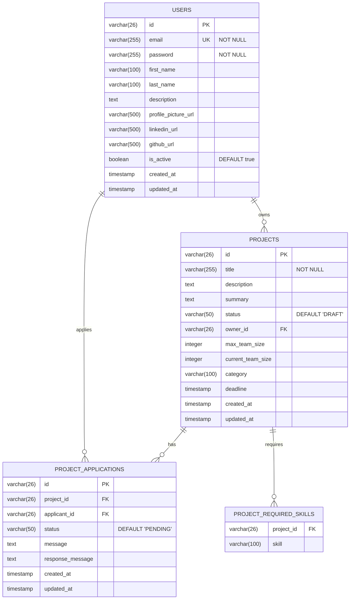

# Database Schema Documentation

This document describes the database schema used in the Proje Pazarı Backend.

## Overview

- **Database**: PostgreSQL 16
- **ORM**: Hibernate (Spring Data JPA)
- **ID Strategy**: ULID (Universally Unique Lexicographically Sortable Identifier)

---

## Entity Relationship Diagram



---

## Tables

### users

Stores user account information.

| Column | Type | Constraints | Description |
|--------|------|-------------|-------------|
| `id` | VARCHAR(26) | PRIMARY KEY | ULID identifier |
| `email` | VARCHAR(255) | NOT NULL, UNIQUE | User email address |
| `password` | VARCHAR(255) | NOT NULL | BCrypt hashed password |
| `first_name` | VARCHAR(100) | | User's first name |
| `last_name` | VARCHAR(100) | | User's last name |
| `description` | TEXT | | Profile description |
| `profile_picture_url` | VARCHAR(500) | | Profile picture URL |
| `linkedin_url` | VARCHAR(500) | | LinkedIn profile URL |
| `github_url` | VARCHAR(500) | | GitHub profile URL |
| `is_active` | BOOLEAN | DEFAULT true | Account status |
| `created_at` | TIMESTAMP | | Creation timestamp |
| `updated_at` | TIMESTAMP | | Last update timestamp |

**Indexes:**
- `users_pkey` - Primary key on `id`
- `users_email_key` - Unique index on `email`

---

### projects

Stores project information.

| Column | Type | Constraints | Description |
|--------|------|-------------|-------------|
| `id` | VARCHAR(26) | PRIMARY KEY | ULID identifier |
| `title` | VARCHAR(255) | NOT NULL | Project title |
| `description` | TEXT | | Detailed description |
| `summary` | TEXT | | Short summary |
| `status` | VARCHAR(50) | DEFAULT 'DRAFT' | Project status |
| `owner_id` | VARCHAR(26) | FOREIGN KEY | Reference to users.id |
| `max_team_size` | INTEGER | | Maximum team members |
| `current_team_size` | INTEGER | DEFAULT 1 | Current team size |
| `category` | VARCHAR(100) | | Project category |
| `deadline` | TIMESTAMP | | Application deadline |
| `created_at` | TIMESTAMP | | Creation timestamp |
| `updated_at` | TIMESTAMP | | Last update timestamp |

**Indexes:**
- `projects_pkey` - Primary key on `id`
- `projects_owner_id_idx` - Index on `owner_id`
- `projects_status_idx` - Index on `status`

**Foreign Keys:**
- `projects_owner_id_fkey` → `users(id)` ON DELETE CASCADE

---

### project_applications

Stores project applications from users.

| Column | Type | Constraints | Description |
|--------|------|-------------|-------------|
| `id` | VARCHAR(26) | PRIMARY KEY | ULID identifier |
| `project_id` | VARCHAR(26) | FOREIGN KEY, NOT NULL | Reference to projects.id |
| `applicant_id` | VARCHAR(26) | FOREIGN KEY, NOT NULL | Reference to users.id |
| `status` | VARCHAR(50) | DEFAULT 'PENDING' | Application status |
| `message` | TEXT | | Application message |
| `response_message` | TEXT | | Owner's response |
| `created_at` | TIMESTAMP | | Creation timestamp |
| `updated_at` | TIMESTAMP | | Last update timestamp |

**Indexes:**
- `project_applications_pkey` - Primary key on `id`
- `project_applications_project_id_idx` - Index on `project_id`
- `project_applications_applicant_id_idx` - Index on `applicant_id`

**Foreign Keys:**
- `project_applications_project_id_fkey` → `projects(id)` ON DELETE CASCADE
- `project_applications_applicant_id_fkey` → `users(id)` ON DELETE CASCADE

---

### project_required_skills

Stores required skills for projects (many-to-many relationship).

| Column | Type | Constraints | Description |
|--------|------|-------------|-------------|
| `project_id` | VARCHAR(26) | FOREIGN KEY | Reference to projects.id |
| `skill` | VARCHAR(100) | | Skill name |

**Foreign Keys:**
- `project_required_skills_project_id_fkey` → `projects(id)` ON DELETE CASCADE

---

## Enumerations

### ProjectStatus

| Value | Description |
|-------|-------------|
| `DRAFT` | Project is not yet published |
| `OPEN` | Project is open for applications |
| `IN_PROGRESS` | Project is actively being worked on |
| `COMPLETED` | Project has been completed |
| `CANCELLED` | Project has been cancelled |

### ApplicationStatus

| Value | Description |
|-------|-------------|
| `PENDING` | Application is waiting for review |
| `APPROVED` | Application has been approved |
| `REJECTED` | Application has been rejected |
| `WITHDRAWN` | Applicant withdrew the application |

---

## ULID Identifiers

This project uses ULIDs instead of traditional UUIDs for primary keys.

**Benefits:**
- Lexicographically sortable (contains timestamp)
- 26 characters (shorter than UUID)
- Case insensitive
- URL safe

**Example:** `01HQXV5KXBW9FYMN8CJZSP2R4G`

---

## Database Configuration

### Development

```properties
spring.datasource.url=jdbc:postgresql://localhost:5432/proje_pazari_db
spring.datasource.username=yazilim
spring.datasource.password=yazilim123
spring.jpa.hibernate.ddl-auto=update
```

### Production

```properties
spring.datasource.url=${SPRING_DATASOURCE_URL}
spring.datasource.username=${SPRING_DATASOURCE_USERNAME}
spring.datasource.password=${SPRING_DATASOURCE_PASSWORD}
spring.jpa.hibernate.ddl-auto=validate
```

---

## Useful Queries

### Count users by status

```sql
SELECT is_active, COUNT(*) 
FROM users 
GROUP BY is_active;
```

### Projects by status

```sql
SELECT status, COUNT(*) 
FROM projects 
GROUP BY status 
ORDER BY COUNT(*) DESC;
```

### Pending applications

```sql
SELECT p.title, COUNT(pa.id) as pending_count
FROM projects p
LEFT JOIN project_applications pa ON p.id = pa.project_id
WHERE pa.status = 'PENDING'
GROUP BY p.title
ORDER BY pending_count DESC;
```

---

## Database Management

### pgAdmin Access

When running with Docker Compose:
- URL: http://localhost:5050
- Email: admin@proje-pazari.com
- Password: admin

### Direct Connection

```bash
# Connect via psql
docker exec -it proje-pazari-db psql -U yazilim -d proje_pazari_db

# List tables
\dt

# Describe table
\d users
```
