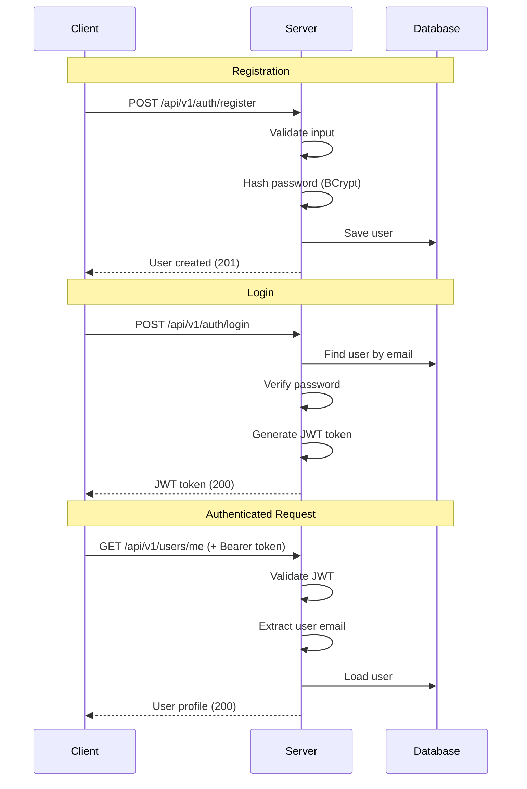

# Security Documentation

This document describes the security architecture and best practices for the Proje Pazarı Backend.

## Overview

The application uses JWT (JSON Web Tokens) for stateless authentication with Spring Security for authorization.

---

## Authentication Flow



---

## JWT Token Structure

### Token Format

```
eyJhbGciOiJIUzI1NiIsInR5cCI6IkpXVCJ9.
eyJzdWIiOiJ1c2VyQHN0ZC5peXRlLmVkdS50ciIsImlhdCI6MTcwNDEyMzQ1NiwiZXhwIjoxNzA0MjA5ODU2fQ.
signature
```

### Claims

| Claim | Description |
|-------|-------------|
| `sub` | Subject (user email) |
| `iat` | Issued at (timestamp) |
| `exp` | Expiration time (timestamp) |

### Token Lifecycle

- **Issuance**: Upon successful login
- **Expiration**: 24 hours (configurable)
- **Validation**: On every authenticated request

---

## Authorization Model

### Current Implementation

The application uses Spring Security's `@PreAuthorize` annotation for method-level security.

```java
@GetMapping("/me")
@PreAuthorize("isAuthenticated()")
public ResponseEntity<UserProfile> getCurrentUser(Authentication auth) {
    // Only authenticated users can access
}
```

### Future: Role-Based Access Control

| Role | Description | Permissions |
|------|-------------|-------------|
| `USER` | Basic authenticated user | View projects, apply to projects |
| `PROJECT_OWNER` | User who created a project | Manage own projects, review applications |
| `ADMIN` | Administrator | Full system access |

---

## Security Components

### JwtUtil

Handles JWT token generation and validation.

```java
@Component
public class JwtUtil {
    // Token generation
    public String generateToken(String email);
    
    // Token validation
    public boolean validateToken(String token);
    
    // Extract claims
    public String extractEmail(String token);
}
```

### JwtAuthenticationFilter

Intercepts requests and validates JWT tokens.

```java
@Component
public class JwtAuthenticationFilter extends OncePerRequestFilter {
    @Override
    protected void doFilterInternal(...) {
        // Extract token from Authorization header
        // Validate token
        // Set authentication context
    }
}
```

### CustomUserDetailsService

Loads user details from database for authentication.

---

## Password Security

### Hashing

Passwords are hashed using **BCrypt** with a strength factor of 10.

```java
@Bean
public PasswordEncoder passwordEncoder() {
    return new BCryptPasswordEncoder();
}
```

### Password Requirements

- Minimum 8 characters
- Should contain uppercase and lowercase letters
- Should contain numbers
- Should contain special characters

---

## Security Best Practices

### ✅ Implemented

| Practice | Implementation |
|----------|----------------|
| Password hashing | BCrypt with strength 10 |
| JWT authentication | Stateless tokens |
| Input validation | Jakarta Bean Validation |
| SQL injection prevention | JPA parameterized queries |
| CORS configuration | Configurable origins |

### 🔄 Recommended for Production

| Practice | Recommendation |
|----------|----------------|
| HTTPS only | Configure SSL/TLS |
| Rate limiting | Add request throttling |
| Token refresh | Implement refresh tokens |
| Account lockout | Lock after failed attempts |
| Audit logging | Log security events |
| Secret management | Use vault solutions |

---

## OWASP Top 10 Mitigations

### A01: Broken Access Control

- JWT token validation on every request
- Authorization checks with `@PreAuthorize`
- Resource ownership validation

### A02: Cryptographic Failures

- BCrypt for password hashing
- HS256 for JWT signing
- No sensitive data in URLs

### A03: Injection

- JPA parameterized queries
- Input validation with Bean Validation
- Output encoding in responses

### A04: Insecure Design

- Clean Architecture separation
- Defense in depth approach

### A05: Security Misconfiguration

- Default security settings
- Environment-specific configuration
- Swagger disabled in production (recommended)

### A06: Vulnerable Components

- Regular dependency updates
- Use `./gradlew dependencyCheckAnalyze` (if added)

### A07: Authentication Failures

- Secure password hashing
- Token expiration
- Email validation

### A08: Data Integrity Failures

- JWT signature validation
- Input validation

### A09: Security Logging

- Spring Boot logging
- Security event logging (recommended)

### A10: Server-Side Request Forgery

- No external URL fetching in current implementation

---

## Security Headers

Recommended security headers (add via filter or reverse proxy):

```java
@Configuration
public class SecurityHeadersConfig implements WebFilter {
    @Override
    public Mono<Void> filter(ServerWebExchange exchange, WebFilterChain chain) {
        exchange.getResponse().getHeaders().add(
            "X-Content-Type-Options", "nosniff");
        exchange.getResponse().getHeaders().add(
            "X-Frame-Options", "DENY");
        exchange.getResponse().getHeaders().add(
            "X-XSS-Protection", "1; mode=block");
        return chain.filter(exchange);
    }
}
```

---

## Environment Security

### JWT Secret

> [!CAUTION]
> **Never commit JWT secrets to version control!**

```bash
# Generate secure secret (Linux/macOS)
openssl rand -base64 32

# Set as environment variable
export JWT_SECRET="your-generated-secret-here"
```

### Database Credentials

```bash
# Use environment variables
export SPRING_DATASOURCE_PASSWORD="secure-password"
```

---

## Reporting Security Vulnerabilities

If you discover a security vulnerability:

1. **Do NOT** open a public GitHub issue
2. Email the security team at: **yazilim@iyte.edu.tr**
3. Include:
   - Description of the vulnerability
   - Steps to reproduce
   - Potential impact
   - Suggested fix (if any)

### Response Timeline

| Action | Timeline |
|--------|----------|
| Acknowledgment | 48 hours |
| Initial assessment | 1 week |
| Fix development | 2-4 weeks |
| Public disclosure | After fix is deployed |

---

## Security Checklist for Contributors

Before submitting a PR, ensure:

- [ ] No sensitive data in logs
- [ ] No hardcoded secrets
- [ ] Input validation on new endpoints
- [ ] Authorization checks on protected resources
- [ ] Password fields are not exposed in DTOs
- [ ] New dependencies checked for vulnerabilities

---

## Additional Resources

- [OWASP Top 10](https://owasp.org/www-project-top-ten/)
- [Spring Security Reference](https://docs.spring.io/spring-security/reference/)
- [JWT Best Practices](https://auth0.com/blog/a-look-at-the-latest-draft-for-jwt-bcp/)
